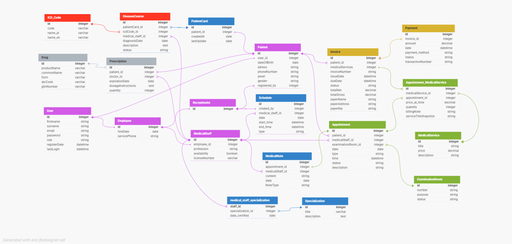

# Medical Clinic Management System

## Project Overview

This application is designed to streamline the management of a medical facility by integrating all key processes, from patient registration to financial settlements.

Its primary objective is to centralize user data, efficiently organize appointments, and securely store information in compliance with legal requirements.

## Key Features

The system offers comprehensive functionalities to manage a modern medical clinic:

- **Patient Management:** Enables the storage of detailed patient data (including PESEL/ID, address, visit history).
- **Staff Scheduling:** Management of medical staff schedules, considering their specializations and availability.
- **Appointment & Room Assignment:** Efficient organization and assignment of appointments to specific examination rooms based on their availability and intended use.
- **Secure Data Storage:** Secure storage of all information in compliance with legal and privacy requirements.
- **Automated Payments:** Automates the payment process by registering transactions, generating unique operation numbers, and tracking their status.

## Technologies Used

The project is built using the following core technologies (assuming typical Java stack):

- **Language:** Java  
- **Framework:** Spring Boot  
- **Data Access:** Spring Data JPA  
- **Web:** Spring Web  
- **Utility:** Lombok  
- **Deployment:** Docker Compose  
- **Build Tool:** Maven  

## Essential Database Tables

- **User:** Base entity for all individuals accessing the system.  
  *Role:* Authentication and identification details.  

- **Employee:** Supertype for all clinic staff.  
  *Role:* Stores common employee information (e.g., hiring date, contact).  

- **MedicalStaff:** Subtype for clinical personnel (Doctors, Nurses, Assistants).  
  *Role:* Clinical functions, prescription and diagnosis.  

- **Receptionist:** Subtype for administrative personnel.  
  *Role:* Administrative tasks, scheduling, booking, payment processing, and patient registration.  

- **Schedule:** Defines working hours, on-call periods, or other time commitments for MedicalStaff.  
  *Role:* Resource planning and availability management.  

- **ExaminationRoom:** Catalog of physical locations/rooms within the clinic.  
  *Role:* Asset management.  

- **Appointment:** Represents a scheduled patient visit with a staff member in a specific room at a specific time.  
  *Role:* Core operational unit, linked to all services, notes, and payments.  

- **MedicalService:** Catalog of all billable medical procedures, consultations, or tests offered by the clinic.  
  *Role:* Defines the standard price and scope of services.  

- **AppointmentService:** Records services rendered during an Appointment.  
  *Role:* Basis for invoicing and financial tracking.  

- **Payment:** Records transaction details for an Appointment.  
  *Role:* Financial accounting and payment tracking.  

- **Patient:** Represents a client of the clinic.  
  *Role:* Core patient identity data.  

- **PatientCard:** Central medical record for a single patient.  
  *Role:* Container for all clinical history.  

- **ICD_Code:** Catalog of officially recognized diseases and conditions (ICD-10).  
  *Role:* Formal diagnosis and reporting.  

- **DiseaseCourse:** Records a specific diagnosis and its progression for a patient.  
  *Role:* Clinical history tracking.  

- **MedicalNote:** Documentation created during or after a patient visit.  
  *Role:* Detailed patient-physician interactions and findings.  

- **Drug:** Catalog of officially registered medicinal products.  
  *Role:* Accurate identification of medications.  

- **Prescription:** Records the formal issuance of a medication to a patient.  
  *Role:* Documentation of medication orders.  

## Database Diagram

The following diagram illustrates the database schema, including all tables and their relationships:

